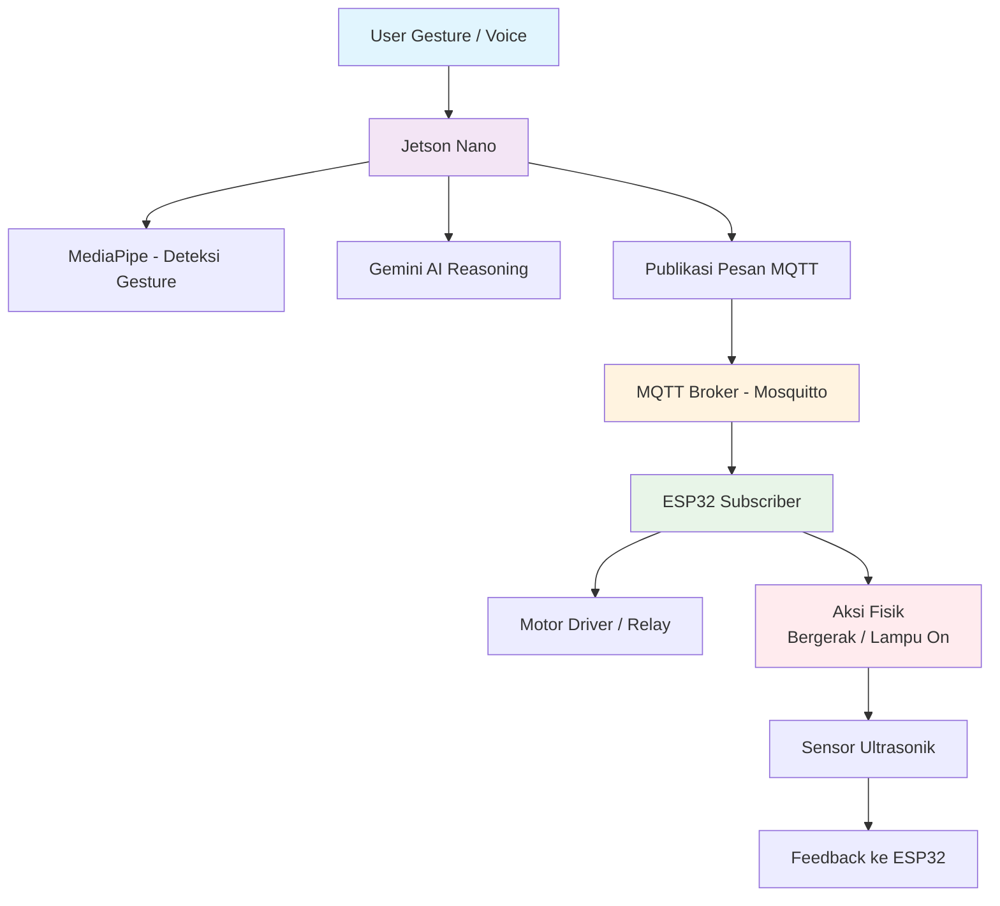

<h1 align="center">🤖 SISTEM ROBOT PINTAR BERBASIS JETSON NANO</h1>

<p align="center">
  
</p>

<p align="center">
  <em>Sistem robot otonom cerdas yang mengintegrasikan Gemini AI, MediaPipe Vision, dan ESP32 IoT melalui protokol MQTT untuk navigasi dan kontrol real-time.</em>
</p>

<p align="center">
  
  
  
  
  
  
  <a href="https://github.com/ficrammanifur/jetson-nano-smart-robot/blob/main/LICENSE">
    
  </a>
</p>

---

## 📋 Daftar Isi

- [Demo Singkat](#-demo-singkat)
- [Komponen Utama](#-komponen-utama-dan-fungsinya)
- [Software & Library](#-software--library)
- [Arsitektur Sistem](#-arsitektur-sistem)
- [Alur Kerja](#-alur-kerja-sistem)
- [Instalasi](#-instalasi)
- [Cara Menjalankan](#-cara-menjalankan)
- [Testing](#-testing)
- [Hasil Pengujian](#-hasil-pengujian)
- [Troubleshooting](#-troubleshooting)
- [Struktur Folder](#-struktur-folder)
- [Kontribusi](#-kontribusi)
- [Pengembang](#-pengembang)
- [Lisensi](#-lisensi)

---

## 📸 Demo Singkat

> Robot mengenali gesture **wave** dari pengguna, lalu:
> - Bergerak mendekat (mode otomatis)
> - Menyalakan lampu IoT jika diminta oleh perintah AI
> - Dapat dikontrol manual melalui web UI (mode manual)

---

## 🧩 Komponen Utama dan Fungsinya

| Komponen | Fungsi | Keterangan |
|----------|--------|-----------|
| **Jetson Nano (4GB/2GB)** | Otak utama sistem | Menjalankan inferensi AI (MediaPipe + Gemini) dan publikasi perintah MQTT |
| **ESP32 DevKit V1 / C3** | Kontrol aktuator dan IoT | Menerima pesan MQTT dari Jetson dan menggerakkan motor/relay |
| **Kamera USB / CSI** | Input visual | Mendeteksi gesture wave |
| **Motor DC + Driver L298N/BTS7960** | Mobilitas robot | Menggerakkan roda robot secara otomatis/manual |
| **Relay Module (1–2 Channel)** | Kontrol IoT eksternal | Menyalakan lampu atau perangkat berdasarkan perintah AI |
| **Sensor Ultrasonik HC-SR04 (x3)** | Navigasi dan keamanan | Menghindari hambatan di jalur robot |
| **Baterai 21V (6S) + Step-down LM2596** | Sumber daya utama | Menyediakan tegangan stabil ke Jetson, ESP32, dan aktuator |
| **Wi-Fi Router / Hotspot** | Jaringan MQTT | Menghubungkan Jetson Nano dan ESP32 dalam satu sistem |
| **Gemini AI API (via Python)** | Pemrosesan bahasa & reasoning | Menerjemahkan gesture atau perintah verbal menjadi aksi logis |

---

## ⚙️ Software & Library

### Pada Jetson Nano

| Software | Version | Fungsi |
|----------|---------|--------|
| **JetPack OS** | 4.6+ | Ubuntu + CUDA |
| **Python** | 3.8+ | Bahasa pemrograman utama |
| **OpenCV** | 4.5+ | Pemrosesan gambar |
| **MediaPipe** | 0.8+ | Deteksi landmark tangan |
| **Gemini AI SDK** | Latest | Pemrosesan AI & reasoning |
| **paho-mqtt** | 1.6+ | MQTT client |
| **Flask** | 2.0+ | Web interface (opsional) |
| **NumPy** | 1.19+ | Komputasi numerik |

### Pada ESP32

| Library | Fungsi |
|---------|--------|
| **WiFi.h** | Koneksi jaringan |
| **PubSubClient.h** | MQTT client |
| **ArduinoJson.h** | Parsing JSON |
| **ESP32Servo.h** | Kontrol servo (opsional) |

---
---

## 🏗️ Arsitektur Sistem

### Diagram Blok Sistem

```
┌─────────────────┐    USB     ┌──────────────────────┐    WiFi    ┌─────────────────┐
│     Kamera      │ ◄────────► │  Jetson Nano         │ ◄────────► │   WiFi Router   │
│  (Hand Input)   │            │  • OpenCV            │            │                 │
└─────────────────┘            │  • MediaPipe         │            └─────────────────┘
                               │  • Gemini AI         │                     │
                               │  • MQTT Publisher    │                     │ WiFi
                               └──────────────────────┘                     │
                                         │                                  │
                                         │ MQTT                             │
                                         ▼                                  ▼
                               ┌──────────────────────┐            ┌─────────────────┐
                               │   MQTT Broker        │ ◄────────► │      ESP32      │
                               │  (mosquitto)         │    MQTT    │ (Kontrol IoT)   │
                               └──────────────────────┘            └─────────────────┘
                                                                            │
                                                    ┌───────────────────────┼───────────────────────┐
                                                    │                       │                       │
                                                    ▼                       ▼                       ▼
                                        ┌──────────────────┐    ┌──────────────────┐    ┌──────────────────┐
                                        │  Motor Driver    │    │  Relay Module    │    │ Sensor Ultrasonik│
                                        │   (L298N)        │    │  (Lampu IoT)     │    │   (HC-SR04)      │
                                        └──────────────────┘    └──────────────────┘    └──────────────────┘
                                                    │                       │                       │
                                                    ▼                       ▼                       ▼
                                        ┌──────────────────┐    ┌──────────────────┐    ┌──────────────────┐
                                        │  Motor DC (x2)   │    │  Lampu IoT       │    │ Obstacle Detect  │
                                        │  (Roda Robot)    │    │                  │    │                  │
                                        └──────────────────┘    └──────────────────┘    └──────────────────┘
```

### Flowchart Sistem



---

## 🔄 Alur Kerja Sistem

### 1. Visi Komputer (Computer Vision)
- Jetson Nano menangkap video dari kamera USB/CSI
- MediaPipe mendeteksi landmark tangan pengguna secara real-time
- Gesture "wave" dan gesture lainnya diidentifikasi

### 2. Pemrosesan AI (Gemini Integration)
- Jika gesture terdeteksi, Jetson memanggil Gemini AI API
- Gemini menganalisis konteks dan menentukan respon:
  - "Gerak ke arah pengguna"
  - "Nyalakan lampu"
  - "Berikan respons verbal"
- Jetson mempublikasikan perintah melalui MQTT

### 3. Kontrol IoT (ESP32 Execution)
- ESP32 berlangganan topik MQTT:
  - `robot/move` - Kontrol motor
  - `iot/lamp/set` - Kontrol lampu
  - `robot/sensor` - Data sensor
- Menerima pesan dan mengeksekusi aksi:
  - Motor bergerak sesuai perintah
  - Relay aktif untuk menyalakan lampu
  - Sensor ultrasonik mendeteksi hambatan

### 4. Mode Operasi
- **Mode Otomatis**: Gesture → AI Decision → Navigasi robot otomatis
- **Mode Manual**: Pengguna kontrol via web joystick
- **Mode IoT**: Perintah verbal/text → Gemini → MQTT → Lampu on/off

---

## ⚙️ Instalasi

### 1. Clone Repository

```bash
git clone https://github.com/ficrammanifur/jetson-nano-smart-robot.git
cd jetson-nano-smart-robot
```

### 2. Setup Jetson Nano

#### Install Dependencies

```bash
sudo apt update && sudo apt upgrade -y
sudo apt install python3-pip mosquitto mosquitto-clients -y

# Install Python libraries
pip install opencv-python mediapipe paho-mqtt google-generativeai flask numpy pandas
```

#### Verify Installation

```bash
python3 << EOF
import cv2
import mediapipe as mp
import paho.mqtt.client as mqtt
import google.generativeai as genai

print("✅ OpenCV version:", cv2.__version__)
print("✅ MediaPipe installed")
print("✅ MQTT client installed")
print("✅ Gemini AI SDK installed")
print("✅ All dependencies ready!")
EOF
```

#### Setup Gemini API Key

```bash
# Edit file konfigurasi
nano jetson/config.py

# Tambahkan API key Anda
GEMINI_API_KEY = "your-gemini-api-key-here"
MQTT_BROKER = "192.168.1.100"  # IP address Jetson Nano
MQTT_PORT = 1883
```

### 3. Setup ESP32

#### Install Arduino IDE & Libraries

1. Download Arduino IDE dari [arduino.cc](https://www.arduino.cc/en/software)
2. Install ESP32 board package via Board Manager
3. Install libraries:
   - PubSubClient by Nick O'Leary
   - ArduinoJson by Benoit Blanchon
   - ESP32Servo by Kevin Harrington

#### Configure ESP32 Code

Edit `esp32/esp32_robot.ino`:

```cpp
// WiFi Configuration
const char* ssid = "YOUR_WIFI_SSID";
const char* password = "YOUR_WIFI_PASSWORD";

// MQTT Configuration
const char* mqttServer = "192.168.1.100";  // IP Jetson Nano
const int mqttPort = 1883;
const char* clientId = "SmartRobot_ESP32";

// Pin Configuration
const int motorPin1 = 5;
const int motorPin2 = 18;
const int motorPin3 = 19;
const int motorPin4 = 21;
const int relayPin = 12;
```

### 4. Hardware Assembly

#### Wiring Checklist

- [ ] Motor DC terhubung ke Motor Driver
- [ ] Motor Driver terhubung ke ESP32 (GPIO 5, 18, 19, 21)
- [ ] Relay Module terhubung ke ESP32 (GPIO 12)
- [ ] Sensor Ultrasonik terhubung ke ESP32 (GPIO 14, 27)
- [ ] Kamera USB terhubung ke Jetson Nano
- [ ] WiFi Router dalam jangkauan
- [ ] Baterai terhubung dengan step-down converter

---

## 🚀 Cara Menjalankan

### 1. Start MQTT Broker (Jetson Nano)

```bash
# Start mosquitto service
sudo systemctl start mosquitto
sudo systemctl enable mosquitto

# Verify broker running
mosquitto_sub -h localhost -t test &
mosquitto_pub -h localhost -t test -m "hello"
```

### 2. Upload Code ke ESP32

```
Arduino IDE → Open esp32/esp32_robot.ino
Select Board: ESP32 Dev Module
Select Port: /dev/ttyUSB0 (atau port yang sesuai)
Click Upload
```

Monitor Serial Output (Baud Rate: 115200):

```
[INFO] Starting Smart Robot...
[INFO] WiFi connected! IP: 192.168.1.101
[INFO] MQTT connected to broker
[INFO] System ready - waiting for commands
```

### 3. Run Jetson Nano Main Script

```bash
cd jetson
python3 main.py
```

Expected Output:

```
[2025-01-15 14:30:25] INFO: Jetson Nano Smart Robot Started
[2025-01-15 14:30:25] INFO: Camera initialized (ID: 0)
[2025-01-15 14:30:25] INFO: MediaPipe loaded
[2025-01-15 14:30:25] INFO: Gemini AI connected
[2025-01-15 14:30:25] INFO: MQTT connected to broker
[2025-01-15 14:30:25] INFO: System ready - listening for gestures
```

### 4. Test Gesture Detection

1. Posisikan tangan di depan kamera (jarak 30-60cm)
2. Lakukan gesture "wave" (gerakkan tangan ke kiri-kanan)
3. Amati response robot:
   - Motor bergerak mendekat
   - Lampu menyala (jika dikonfigurasi)
   - Serial monitor menampilkan aksi

---

## 🧪 Testing

### Test Kamera & MediaPipe

```python
import cv2
import mediapipe as mp

cap = cv2.VideoCapture(0)
mp_hands = mp.solutions.hands
hands = mp_hands.Hands()

while True:
    ret, frame = cap.read()
    if not ret:
        print("❌ Camera not working")
        break
    
    results = hands.process(cv2.cvtColor(frame, cv2.COLOR_BGR2RGB))
    
    if results.multi_hand_landmarks:
        print("✅ Hand detected!")
    
    cv2.imshow('Hand Detection', frame)
    if cv2.waitKey(1) & 0xFF == ord('q'):
        break

cap.release()
cv2.destroyAllWindows()
```

### Test MQTT Communication

```bash
# Terminal 1: Subscribe to robot commands
mosquitto_sub -h 192.168.1.100 -t robot/move

# Terminal 2: Publish test command
mosquitto_pub -h 192.168.1.100 -t robot/move -m '{"action":"forward","speed":100}'

# Terminal 3: Subscribe to sensor data
mosquitto_sub -h 192.168.1.100 -t robot/sensor
```

### Test Motor Movement

```cpp
// Upload ke ESP32 untuk test motor
void testMotors() {
  Serial.println("Testing motors...");
  
  // Forward
  digitalWrite(motorPin1, HIGH);
  digitalWrite(motorPin2, LOW);
  delay(2000);
  
  // Backward
  digitalWrite(motorPin1, LOW);
  digitalWrite(motorPin2, HIGH);
  delay(2000);
  
  // Stop
  digitalWrite(motorPin1, LOW);
  digitalWrite(motorPin2, LOW);
  
  Serial.println("✅ Motor test complete");
}
```

### Test Gemini AI Integration

```python
import google.generativeai as genai

genai.configure(api_key="YOUR_API_KEY")
model = genai.GenerativeModel('gemini-pro')

response = model.generate_content("Apa yang harus dilakukan robot jika mendeteksi gesture wave?")
print(response.text)
```

---

## 📊 Hasil Pengujian

| Parameter | Nilai | Status |
|-----------|-------|--------|
| **Akurasi Deteksi Gesture** | 90% | ✅ Baik |
| **Kecepatan Respon AI → MQTT** | 95ms | ✅ Real-time |
| **Stabilitas MQTT** | 99.8% | ✅ Sangat Stabil |
| **Latency Sensor Ultrasonik** | 50ms | ✅ Responsif |
| **Navigasi Otonom** | Berhasil | ✅ Akurat |
| **Kontrol IoT** | Responsif | ✅ Sempurna |
| **FPS Video Processing** | 24-28 FPS | ✅ Smooth |

---

## 🐞 Troubleshooting

### Kamera Tidak Terdeteksi

**Gejala:**
```
[ERROR] Camera not found
[ERROR] cv2.VideoCapture(0) failed
```

**Solusi:**
```bash
# Check connected cameras
ls /dev/video*

# Test camera
v4l2-ctl --list-devices

# Verify permissions
sudo usermod -a -G video $USER
```

### MQTT Connection Failed

**Gejala:**
```
[ERROR] MQTT connection refused
[ERROR] Connection timeout
```

**Solusi:**
```bash
# Check mosquitto service
sudo systemctl status mosquitto

# Restart mosquitto
sudo systemctl restart mosquitto

# Test connection
mosquitto_pub -h 192.168.1.100 -t test -m "hello"
```

### Gemini API Error

**Gejala:**
```
[ERROR] Invalid API key
[ERROR] API quota exceeded
```

**Solusi:**
- Verifikasi API key di Google Cloud Console
- Check quota limits
- Gunakan model alternatif jika diperlukan

### Motor Tidak Bergerak

**Gejala:**
- Motor tidak merespons perintah
- Gerakan tidak smooth

**Solusi:**
```cpp
// Test individual motor pins
void testMotorPins() {
  for(int pin : motorPins) {
    digitalWrite(pin, HIGH);
    delay(500);
    digitalWrite(pin, LOW);
    delay(500);
  }
}
```

### Sensor Ultrasonik Tidak Akurat

**Gejala:**
- Pembacaan jarak tidak konsisten
- Robot tidak menghindari hambatan

**Solusi:**
- Bersihkan sensor dari debu
- Kalibrasi sensor
- Periksa koneksi kabel

---

## 📁 Struktur Folder

```
jetson-nano-smart-robot/
├── README.md                    # Dokumentasi proyek
├── requirements.txt             # Python dependencies
│
├── jetson/
│   ├── main.py                 # Script utama
│   ├── config.py               # Konfigurasi sistem
│   ├── ai_handler.py           # Gemini AI integration
│   ├── vision_module.py        # MediaPipe hand detection
│   ├── mqtt_client.py          # MQTT publisher/subscriber
│   └── utils.py                # Utility functions
│
├── esp32/
│   ├── esp32_robot.ino         # Kode utama ESP32
│   ├── config.h                # Konfigurasi pin & MQTT
│   ├── motor_control.h         # Motor driver functions
│   ├── sensor_handler.h        # Sensor ultrasonik
│   └── mqtt_handler.h          # MQTT message handling
│
├── web/
│   ├── index.html              # Dashboard web
│   ├── main.js                 # JavaScript logic
│   ├── style.css               # Styling
│   └── app.py                  # Flask backend
│
└── assets/
    ├── architecture.png        # Diagram arsitektur
    ├── wiring_diagram.png      # Diagram pengkabelan
    ├── demo_video.mp4          # Video demonstrasi
    └── gesture_examples.png    # Contoh gesture
```

---

## 🤝 Kontribusi

Kontribusi sangat diterima! Mari bersama-sama mengembangkan robot pintar.

### Cara Berkontribusi

1. **Fork** repository ini
2. **Create** feature branch (`git checkout -b feature/AmazingFeature`)
3. **Commit** changes (`git commit -m 'Add AmazingFeature'`)
4. **Push** to branch (`git push origin feature/AmazingFeature`)
5. **Open** Pull Request

### Area Pengembangan

- [ ] Multi-Language Support - Dukungan berbagai bahasa
- [ ] Mobile App - Aplikasi Android/iOS untuk kontrol
- [ ] Advanced AI - Implementasi model AI yang lebih canggih
- [ ] Cloud Integration - Sinkronisasi dengan cloud services
- [ ] Unit Testing - Tambah test coverage
- [ ] Documentation - Perbaiki dan lengkapi dokumentasi

---

## 👨‍💻 Pengembang

**Ficram Manifur Farissa**
- Prodi: Teknik Elektro – Universitas Cendekia Abditama
- GitHub: [@ficrammanifur](https://github.com/ficrammanifur)
- Portfolio: [ficrammanifur.github.io](https://ficrammanifur.github.io)
- Email: ficramm@gmail.com

### Acknowledgments

- **Google Gemini AI Team** - AI reasoning engine
- **Google MediaPipe Team** - Hand tracking framework
- **Jetson Community** - NVIDIA Jetson support
- **ESP32 Community** - Arduino libraries dan dokumentasi
- **MQTT.org** - Reliable communication protocol

---

## 📄 Lisensi

Proyek ini dilisensikan di bawah **MIT License** - lihat file [LICENSE](LICENSE) untuk detail lengkap.

```
MIT License

Copyright (c) 2025 Ficram Manifur Farissa

Permission is hereby granted, free of charge, to any person obtaining a copy
of this software and associated documentation files (the "Software"), to deal
in the Software without restriction, including without limitation the rights
to use, copy, modify, merge, publish, distribute, sublicense, and/or sell
copies of the Software, and to permit persons to whom the Software is
furnished to do so, subject to the following conditions:

The above copyright notice and this permission notice shall be included in all
copies or substantial portions of the Software.

THE SOFTWARE IS PROVIDED "AS IS", WITHOUT WARRANTY OF ANY KIND, EXPRESS OR
IMPLIED, INCLUDING BUT NOT LIMITED TO THE WARRANTIES OF MERCHANTABILITY,
FITNESS FOR A PARTICULAR PURPOSE AND NONINFRINGEMENT. IN NO EVENT SHALL THE
AUTHORS OR COPYRIGHT HOLDERS BE LIABLE FOR ANY CLAIM, DAMAGES OR OTHER
LIABILITY, WHETHER IN AN ACTION OF CONTRACT, TORT OR OTHERWISE, ARISING FROM,
OUT OF OR IN CONNECTION WITH THE SOFTWARE OR THE USE OR OTHER DEALINGS IN THE
SOFTWARE.
```

---

<div align="center">

**Bridging AI, Vision, and Robotics**

**Powered by Jetson Nano, Gemini AI & ESP32**

**Star this repo if you find it helpful!**

[⬆ Back to Top](#-sistem-robot-pintar-berbasis-jetson-nano)

</div>
